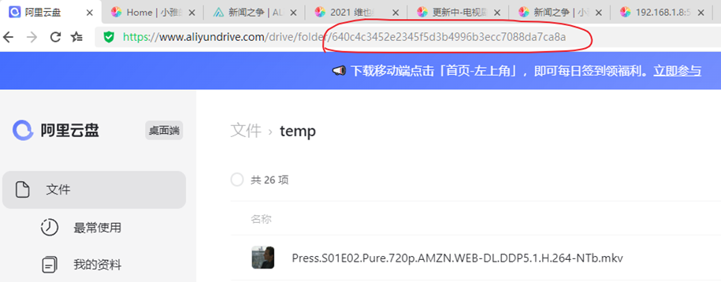
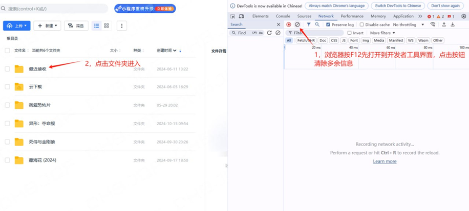
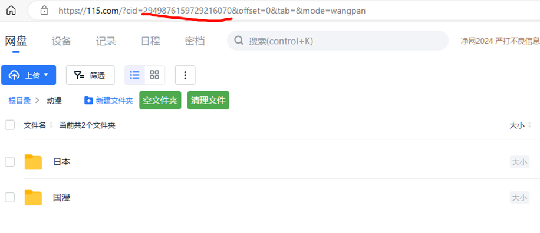
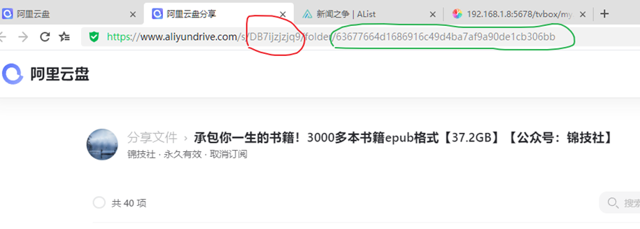
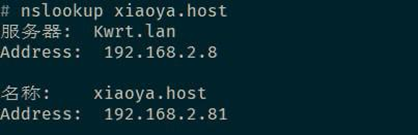
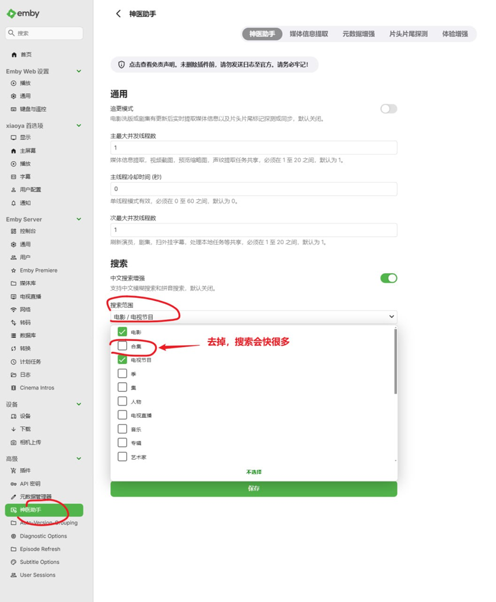
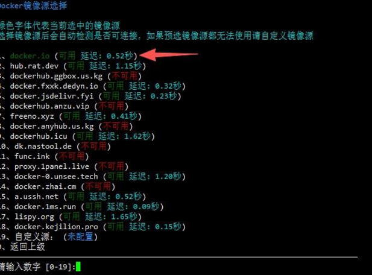
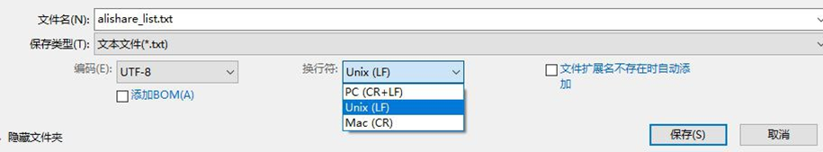
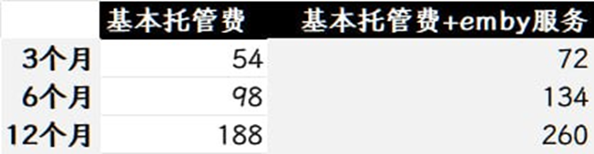

# 小雅指南

要获得最新小雅的资讯请关注小雅的tg频道  [https://t.me/xiaoya_media](https://t.me/xiaoya_media)

平时有什么使用上遇到的困难可以来这里找我或其他人帮助  [https://t.me/xiaoyaliu00](https://t.me/xiaoyaliu00)

# 一、xiaoya是什么

## **（一）xiaoya**

基于alist平台深度魔改开发的资源聚合与播放工具（非开源），整合网络上大量公开的海量阿里云盘、115网盘共享资源到统一界面，将影视、动漫、剧集等内容分门别类罗列展示，属于开箱即用型方案，不用用户自己费心寻找视频资源。借助用户个人的阿里云盘、115网盘账号，可在NAS、服务器、小主机、mac等支持docker的设备上方便快速搭建个人影音库，主打一键部署、海量影视资源、在线直连播放，包含xiaoya alist、xiaoya tvbox（已整合在xiaoya alist）、xiaoya emby等三大平台，以及爬虫等辅助工具，可通过webdav、tvbox、emby等协议对接各类媒体播放器和电视端

## **（二）xiaoya alist**

Docker环境部署，资源占用低、加载快，对系统要求极低，N1盒子、20块/年的云服务器等设备可轻松部署，端口5678，支持索引搜索，部分资源web端可直接转码播放，支持WebDAV，可挂载到各类播放器APP（会失去搜索功能），播放时自动转存到你的中转目录，解析直链播放，自动清理，避免占用你的网盘空间

## **（三）xiaoya tvbox**

专为电视/盒子端打造的原生播放方案，无需单独部署，安装xiaoya alist后即可使用，自动同步xiaoya alist里聚合的海量影视资源，无需自行刮削元数据，直接呈现海报墙与分类目录，支持一键播放、多清晰度切换、字幕加载，整合了饭太硬等热门tvbox源，壳子推荐使用OK影视（配置http://xxxx:5678/tvbox/my_ext_jar.json到壳子里即可），实现自动找源、切源
注意事项：
1、目前仅安卓可用，电脑可用模拟器运行安卓版ok影视
2、用户名和密码与5678网页一致，如遇tvbox弹出用户名和密码输入框，建议先在xiaoya alist网页确保用户名密码能登陆成功

## **（四）xiaoya emby**

xiaoya生态里的核心媒体服务，基于Emby深度适配 xiaoya alist，解决了xiaoya alist海量影视资源的可视化管理与优雅播放问题。Docker环境安装，资源占用高，系统要求高，推荐N100或以上cpu、内存8G以上、剩余空间250g的ssd的设备部署，必须要有网盘会员（详见后文），端口2345、6908（不推荐挂载使用）。可通过爬虫自动拉取与xiaoya alist精选资源元数据（strm播放地址、海报、字幕、豆瓣/TMDB 影视信息等），无需手动刮削，开箱即用就能生成精美海报墙，支持多端（手机、电视、电脑）播放，配合docker一键部署，快速搭建出无需找资源、自带精美界面的私人家庭影院

## **（五）xiaoya Emby和xiaoya tvbox的主要差异点**


# 二、安装xiaoya准备工作

## **（一）找到组织**

【重要提醒】不要相信任何引导你去验证的消息，无论是群友还是管理员

Xiaoya媒体发布 [https://t.me/xiaoya_media](https://t.me/xiaoya_media)

Xiaoya官方群聊 [https://t.me/xiaoyaliu00](https://t.me/xiaoyaliu00) （多看群置顶）

## **（二）安装xiaoya alist的条件**

1.阿里云盘账号

2.115账号

3.有docker环境的硬件设备（Nas、小主机、mac、云服务器等都可以，不推荐windows）

4.良好的翻墙网络环境

## **（三）安装xiaoya emby的条件**

1.已安装好xiaoya alist，并可正常使用

2.n100同等水平cpu，8g以上内存，SSD剩余空间250G以上

3.115、阿里云盘至少有一个会员

## **（四）xiaoya emby完美硬件组合**

1.N100或者N150以上的小主机

2.16G内存

3.512G M.2 SSD

4.阿里/115双会员

5.Apple TV盒子

6.infuse为主，senplayer为辅

上述组合，基本平时不需要折腾，非常稳定很少出意外

## **（五）xiaoya所需会员指南**

1.乞丐版：无任何会员（阿里、115均限速100-500k，满足看emby画报，播放用tvbox各种免费源）

2.基础版：阿里非会员+115会员（配置ali2115.txt，将阿里资源转存到115播放，只能保证95%的播放成功率，冷门、特别新的可能播放失败，但性价比很高）

3.升级版：阿里超级会员+115会员（配置tvtoken解决阿里超级会员高速流量问题，可以保证100%的播放成功率）

4.豪华版：阿里超级会员+阿里三方权益包+115会员（不差钱！！）

自己选个套餐搭配，记住不是给小雅充哦，是给自己充，对自己好点哦~

# 三、安装指南

## **（一）原版xiaoya安装脚本**

[https://github.com/DDS-Derek/xiaoya-alist](https://github.com/DDS-Derek/xiaoya-alist)

SSH到计划安装xiaoya的设备后，获取root权限（sudo -i），执行上面页面中的脚本，请按以下顺序安装（要有翻墙环境），如遇问题群里截图反馈

## **（二）安装xiaoya alist（包含tvbox）**

1.安装 小雅Alist -> 1 1

注意事项：

①不清楚的选项，全用默认

②token、cookie全用脚本扫码获取，网页获取不了就选命令行扫码

③阿里的转存目录folder id，浏览器打开你的阿里云盘，在根目录新建“xiaoya”文件夹（千万不要删除该文件夹）, 进入新建的“xiaoya“文件夹，浏览器地址栏https://www.aliyundrive.com/drive/folder/640xxxxxxxxxxxxxxxxxxxca8a最后一串就是folder id



2.安装/更新 小雅助手（xiaoyahelper）-> 3 1

3.安装 115清理助手 -> 4 1 （如未配置115，跳过这步）

4.如果你有阿里云盘超级会员，脚本主界面输入“fuckaliyun”，配置TVtoken，否则直接下一步

5.安装好后浏览器打开ip:5678，播放元数据目录下视频，确保可以播放，且115、阿里云盘至少有一个会员后再安装emby（如果只有115会员，需在脚本1-4配置7，并保存重启xiaoya）

## **（三）安装xiaoya emby**

1.图形化编辑 emby_config.txt -> 2 4，其中，①选关闭。②选host模式。③ARM的选iceyheart/embycrk，X86的选amilys/embyserver。④选第三个（4.9.0.42）。⑤填入你磁盘空间充足（剩余空间250g以上）的媒体库目录地址

2.安装 Emby全家桶（一键） -> 2 1

3.安装 小雅元数据定时爬虫 -> 2 5 1 （选项全部用默认），安装后观察爬虫日志，爬虫运行完毕后进行下一步

4.爬虫运行完毕后浏览器打开ip:2345，右上角“设置”，左边栏“计划任务”，启动“Scan media library”，该扫库（第一次）操作耗时很久，期间emby会非常卡，且进度条跟时间不成正比，扫库进行时最好不要对emby进行任何操作，会延长扫库时间，耐心等待

# 四、使用指南

## **（一）常用本地路径**

**1.xiaoya配置目录**

xiaoya alist必备基础目录，目录中包含子文件夹“data”，目录中很多txt，目录中txt的变动需要重启xiaoya才能生效

查看小雅配置文件目录路径的命令：

```jsx
docker inspect xiaoya | grep "/data" |head -n1
```

**2.媒体库目录**

xiaoya emby必备路径，安装xiaoya emby时候已在脚本2-4中设置，目录中包含“config”、“temp”、“xiaoya”三个子文件夹，其中，“config”是emby配置文件夹，“temp”是元数据包存放文件夹，里面除了config.mp4，其余的均可删除，“xiaoya”是元数据文件夹。

查看小雅媒体库目录路径的命令：

```jsx
cat  /etc/DDSRem/xiaoya_alist_media_dir.txt
```

**3.常用命令**

①显示每个容器的使用情况：

```jsx
docker stats
```

②重启名为xiaoya容器：

```jsx
docker restart xiaoya
```

③持续查看名为xiaoya容器的日志：

```jsx
docker logs -f xiaoya
```

④查看emby日志（包括入库、播放等）：

```jsx
docker exec emby tail -f /config/logs/embyserver.txt
```

⑤查看xiaoya容器的环境变量：

```jsx
docker inspect xiaoya
```

⑥查看外网访问时间和路径（xx.xx.xx.xx替换为外网ip）：

```jsx
docker exec xiaoya cat /var/log/nginx/access.log | grep xx.xx.xx.xx
```

```jsx
docker exec xiaoya cat /opt/alist/log/alist.log | grep xx.xx.xx.xx
```

⑦查看转存的资源是什么应用发起的（abc替换为日志中资源全文件名）：

```jsx
docker exec -i xiaoya cat /var/log/nginx/access.log |grep abc
```

⑧查看所有下载mp4（可根据需要自行替换成其他）的ip记录：

```jsx
docker exec -i xiaoya cat log/alist.log |grep mp4
```

⑨查看外网请求ip的时间和状态：

```jsx
docker exec -i xiaoya grep --no-line-number '/d/' /var/log/nginx/access.log |awk '{print $1, "\t", $9, "\t", $4, $12}' |grep -E -v "172.17|127.0|192.168"|sort |uniq -c
```

第一栏统计数 第二栏ip 第三栏状态码 第四栏时间 第五栏UA

状态码是403或者401的都是没授权，签名错误的是403，是有嫌疑的连接

## **（二）xiaoya相关账号密码**

**1.xiaoya alist/tvbox账号密码（用户名不支持修改）**

【懒人版】

用户名：dav

密码：用这个↓命令查看

```jsx
docker exec -i xiaoya cat /data/guestpass.txt
```

【认真版】

注意：推荐使用配置①，即两个txt都配置，其余配置存在账号安全风险！！！（是否有配置txt，需自行查看xiaoya配置目录，每次配置后需要重启xiaoya生效）

①配置了guestlogin.txt（空文件）+guestpass.txt（填入无任何格式的明文密码）：用户名dav，密码见guestpass.txt

②仅配置guestlogin.txt（空文件）：用户名guest，密码guest_Api789

③仅配置guestpass.txt（填入无任何格式的明文密码）：用户名guest，密码见guestpass.txt

**2.xiaoya emby账号密码**

用户名：xiaoya/kid 密码：1234

上述默认账号自带播放记录，如果不喜欢，可以在emby设置里自建自己的账号

## **（三）播放器推荐**

**1.Windows PC端：**

小雅alist：5678网页调用potplayer、vlc（可播原盘）等第三方播放器

小雅emby：Hills Lite（[https://t.me/xiaoyaliu00/1119303](https://t.me/xiaoyaliu00/1119303)、 [https://apps.microsoft.com/detail/9nxnzfrllwzx?hl=en-US&gl=US](https://apps.microsoft.com/detail/9nxnzfrllwzx?hl=en-US&gl=US) ）

**2.安卓手机：**

小雅emby：爆米花（可播原盘）、afusekt（支持聚合）、vidhub （在线匹配字幕）、yamby

**3.安卓电视：**

小雅emby：爆米花（可播原盘）、vidhub（在线匹配字幕）、afusektv（收费，需搭配安卓手机使用）、yamby（免费，适配少量电视、投影）

**4.ios：**

小雅alist & emby：senplayer（可播原盘）、vidhub（在线匹配字幕，可播原盘，挂载5678后需要长按选禁用）

小雅emby：infuse（可播原盘、效果好，需要关闭媒体库模式）、爆米花（可播原盘、免费）

**5.Apple Tv：**

小雅alist & emby：senplayer（可播原盘）

小雅emby：infuse（可播原盘，效果好，需要关闭媒体库模式）、vidhub（可播原盘）、爆米花（可播原盘、免费）

各种支持webdav、emby且不刮削的app均可挂载小雅，以上仅为常用推荐！

## **（四）播放器挂载xiaoya alist**

①通讯协议选择webdav

②主机：部署xiaoya alist的设备ip

③路径：/dav

④端口：5678

⑤用户名：dav或guest，具体见上文

⑥密码：guestpass.txt的内容

注意，不要开任何刮削选项（包括但不限于预缓存图像、媒体库模式等），如果你不确定，截图发群里

## **（五）播放器挂载xiaoya tvbox**

配置http://xxxx:5678/tvbox/my_ext_jar.json到壳子里。壳子建议用ok影视

## **（六）播放器挂载xiaoya emby**

①通讯协议选择emby

②协议：http

③主机：部署xiaoya alist的设备ip

④端口：2345

⑤用户名：xiaoya或你自己设置的

⑥密码：1234或你自己设置的

## **（七）爆米花挂载xiaoya alist的strm**

**1.爆米花挂载strm优缺点**

缺点：无演员关联的电影信息。海量媒体入库慢，20万以上频繁失败，10万以内没问题

优点：无需硬件设备去支撑emby。搜索啥的比emby快

**2.使用方法**

推荐：用木木模拟器运行爆米花导入，全部导入仅需6小时，约52万strm文件（"刮削失败"除外），可一次性成功

①更新爆米花2.9.4版本或以上，添加webdav，“位置”填xiaoya服务端ip地址，“端口”填“5678”，“用户名”“密码”如不清楚见上文，“路径”填“/dav/strm”，选择“保存”

②不要勾选“刮削失败”“音乐”“测试”“短剧”“画质演示测试”

③尽可能选择一个相对小的目录（如“每日更新”）来尝试，不要全部导入！！因为strm文件非常多，导入时间很很长！！爆米花识别的准确率会低一些！！

④爆米花中播放使用

**3.常见问题**

①已更新但5678没有出现“strm”目录：

[https://t.me/xiaoyaliu00/1380918](https://t.me/xiaoyaliu00/1380918)

②其他app能用吗：

不清楚，需要自行挖掘，目前反馈vidhub可用（但挂载多了会卡死）

## **（八）软件播放xiaoya alist音乐**

详见 [https://t.me/xiaoyaliu00/760695](https://t.me/xiaoyaliu00/760695)

# 五、进阶指南

## **（一）xiaoya alist相关**

**1.webdav挂载其他网盘到xiaoya alist：**

详见[https://t.me/xiaoyaliu00/895158](https://t.me/xiaoyaliu00/895158)

**2.xiaoya挂载本地硬盘文件目录**

xiaoya配置目录新建local_dir.txt，就能在“ip:5678/NAS” 目录访问，你可以把本地的视频，音频，甚至其它文件加载到xiaoya，目前暂时仅能挂载1个本地目录

**3.公网安全措施：**

①配置域名，配合下文“公网访问限制”

②如果路由器做端口转发，配置一个30000以上的端口，比如 30283->5678

③配置xiaoya的webdav域名，也就是编辑 guestpass.txt

④定期重启光猫，变更ip详见

**4.外网安全检查：**

详见[https://t.me/xiaoyaliu00/918606](https://t.me/xiaoyaliu00/918606)

**5.公网访问限制：**

详见[https://t.me/xiaoyaliu00/974894](https://t.me/xiaoyaliu00/974894)

**6.签名机制：**

详见[https://t.me/xiaoyaliu00/1091310](https://t.me/xiaoyaliu00/1091310)

**7.查看115网盘目录ID的方法：**





**8.xiaoya alist中添加“我的115”：**

xiaoya配置目录下，配置115_list.txt（具体内容见下），重启xiaoya生效

①如挂根目录，则群文件找一个，txt内容是 “115 0”

②如挂具体内幕，准确的格式是：

挂载名称 [空格] 目录id [空格] 目录密码 [回车]

没有密码就不用填密码，格式里面注明的空格和回车都要补上，例如：

挂载名称 [空格] 目录id [空格] [回车]

**9.xiaoya alist中添加“我的阿里云盘”：**

xiaoya配置目录下，配置show_my_ali.txt（直接群文件找现成的），重启xiaoya生效

**10.xiaoya alist中添加“我的阿里分享”：**

xiaoya配置目录下，配置alishare_list.txt（群文件有模板），准确的格式是：

挂载名称 [空格] 阿里分享ID [空格] 文件folder id [空格] 目录密码 [回车]

没有密码就不用填密码，格式里面注明的空格和回车都要补上，挂载名不能有空格



**11.xiaoya alist中添加“我的115分享”：**

xiaoya配置目录下，配置115share_list.txt（群文件有模板），准确的格式是：

挂载名称 [空格] 115分享ID [空格] 分享目录id提取码 [空格] 目录密码 [回车]

没有密码就不用填密码，格式里面注明的空格和回车都要补上，挂载名不能有空格

**12.设置xiaoya.host映射**

①软路由上设置：也就是全屋通用，比如默认网关和dns都在n1上，然后在n1的/etc/hosts 里配置 xiaoya.host （格式见图）



n1的IP是 192.168.2.8

xiaoya 所在的硬件 IP是 192.168.2.81

每个人的网络环境不一样，配置方法也不一样，如果你的软路由无法修改 /etc/hosts，那么可以用其它dns软件比如smartdns来实现类似的结果

②播放设备上设置：如果实在不会配置路由器上的解析，那么退而求其次，配置播放设备上的解析（只对单台设备起作用，比较麻烦，手机要配置，PC要配置，电视盒子要配置）

安卓手机：[https://github.com/x-falcon/Virtual-Hosts](https://github.com/x-falcon/Virtual-Hosts)

苹果 mac，ios应该也有类似的工具

③windows设置：编辑C:\Windows\System32\drivers\etc\hosts,添加xiaoya.host 及对应ip

**13.设置xiaoya alist定时重启：**

装好xiaoyakeeper（xiaoyahelper）,xiaoya配置目录下，配置myruntime.txt（模板群文件有），myruntime.txt中定义的时间点会做三件事：一是重启小雅；二是如果小雅有更新就更新小雅（如不想更新，则在mycmd.txt用“#”注释update_xiaoya那一行）；三是做一次清理。如果没有myruntime.txt这个文件，则默认xiaoyakeeper的启动/重启时干这三件事

**14.alist套娃xiaoya alist：**

通过v3驱动方式套娃，把令牌填到 Authorization（令牌见xiaoya配置目录中alist_auth_token.txt），Server填部署xiaoya的设备内网ip，不要填账号和密码

请注意，套webdav驱动无302，套openlist驱动可以302。套娃会丧失搜索功能和阿里转码播放功能

**15.xiaoya alist套娃alist：**

xiaoya配置目录下，配置alist_list.txt（群文件有模板），可以挂载挂载一个或多个 Alist 套娃，txt内容最下面需要留一个空行，重启xiaoya生效

**16.建立自己的索引：**

①把alist挂到本地硬盘，可以用rclone和davfs2 来实现，小雅是用轻量级的dafs2，配置非常简单，安装davfs2后，执行以下命令

```jsx
mkdir /mnt/xiaoya
```

```jsx
mount.davfs http://xxx:5678/dav  /mnt/xiaoya
```

然后输入用户名、密码，然后执行命令

```jsx
cd /mnt/xiaoya
```

```jsx
find ./元数据
```

就是拉了个“/元数据”目录的清单，其他目录以此类推

②xiaoya配置目录下，新建myindex.txt，把上面生成的索引黏贴进去，最后留一个空行，保存，重启xiaoya生效

## **（二）xiaoya emby相关**

**1.ConverArt插件（emby 115、iso媒体封面标识）：**

详见 [https://t.me/xiaoyaliu00/1220110](https://t.me/xiaoyaliu00/1220110)

**2.将xiaoya alist中的资源添加到emby：**

详见 [https://xiaoyaliu.notion.site/d353c9ceb15444d7b8e21ce6097ed739?v=145044ac8252470a9feef094ff1db520](https://www.notion.so/d353c9ceb15444d7b8e21ce6097ed739?pvs=21)

因115风控收紧，自己拉strm的，把一个大目录拆分成一堆小的子目录，分批执行，中间加插停顿，具体参考[https://t.me/xiaoyaliu00/1361900](https://t.me/xiaoyaliu00/1361900)

**3.安装神医助手（首字母搜索）**

①[https://t.me/xiaoyaliu00/1259686](https://t.me/xiaoyaliu00/1259686)下载后，放入“本地媒体库目录/config/plugins”文件夹中

②重启emby

③如提示“魔改失败”，[https://github.com/sjtuross/StrmAssistant.Releases/blob/main/plugins/MovieDb_10.8.6.0.zip](https://github.com/sjtuross/StrmAssistant.Releases/blob/main/plugins/MovieDb_10.8.6.0.zip)下载解压 MovieDb10.8.6替换同名dll，重启emby

④“中文搜索增强-搜索范围”取消“合集”勾选



注意：不要动任何神医的设置！除非你知道你在做什么！

**4.设置每日定时扫库：**

浏览器打开ip:2345，右上角“设置”，左边栏“计划任务”，点击“Scan media library”，点击“添加触发器”，建议扫库时间设置在后半夜

# 六、常见问题

## **（一）启动问题**

**1.xiaoya启动后，页面只有failed get storage: please add a storage first，或者只有版本号的：**

都是因为没有下载到数据导致，目前数据下载地址已经更换到github，需要翻墙才能下载，不会翻墙自行解决，确保xiaoya已经升级到最新版本（必须是原版xiaoya，非原版的有任何问题都不管），并翻墙后运行以下命令即可

```jsx
docker exec xiaoya rm -rf /www/data/version.txt  && docker restart xiaoya && docker logs -f -n 100 xiaoya
```

不要说什么已经翻墙之类的话，只要下载不到github数据，或日志出现 “curl: (7) Failed to connect to raw.githubusercontent.com port 443 after 30 ms: Could not connect to server” 或 “Parse error near line 1: no such table: x_storages” 就是百分百没翻墙或翻墙设置有问题，自行处理解决

PS:如果你安装的是飞牛NAS里面的小雅alist套件，请自行卸载该套件，该套件不可用

**2.访问alipan-tv-token.pages.dev出错：**

安装自建tvtoken容器（脚本5-5），如已安装过则卸载重装，并执行以下命令（以下是一整条命令，别分割为多段命令）

```jsx
docker exec xiaoya sh -c "echo 'http://172.17.0.1:34278/oauth/alipan/token' > /data/open_tv_token_url.txt"
```

最后需要重启xiaoya

**3.TV容器访问报错：**

详见 [https://t.me/xiaoyaliu00/1231846](https://t.me/xiaoyaliu00/1231846)

[https://t.me/xiaoyaliu00/1231849](https://t.me/xiaoyaliu00/1231849)

**4.2345端口显示500、502：**

①用[https://t.me/xiaoyaliu00/1330129](https://t.me/xiaoyaliu00/1330129)替换你xiaoya配置目录里的同名文件，然后重启xiaoya、emby。

②如果还是不行就把这个txt中的ip字段（也就是前后的都别动）改成局域网ip，然后重启xiaoya、emby。

③如果如果仍然不行，ssh并获取root权限后，使用 netstat -ltnp 命令，查看2345、6908等端口是否有被监听

④若6908没监听：emby安装有问题，脚本2-2-7重新解压config.mp4，然后删除docker中的emby，脚本2-3单独重装emby（需先配置好2-4）。若6908有监听：用https://t.me/xiaoyaliu00/1330145（容器外操作）图中命令curl三次，如果均无返回，你的防火墙有问题。openwrt类的软路由系统的防火墙是针对接口的，有些默认配置是会拦截docker网络接口，自行操作放行2345、2346、2347、5678、6908。

拓展知识：

根本性原理就是xiaoya容器用哪个ip能访问到emby容器，emby_server.txt就用哪个ip就行。用curl测一下就知道，操作如下：

[https://t.me/xiaoyaliu00/1330145](https://t.me/xiaoyaliu00/1330145) （容器外操作）

[https://t.me/xiaoyaliu00/1330139](https://t.me/xiaoyaliu00/1330139) （容器内操作）

以上例子是host模式的xiaoya，所以三种curl均有效。如果是bridge模式的xiaoya，第一种就不会有效，下面的才会有效。

**5.脚本镜像拉取不了、token获取验证失败、启动不成功：**

！！！确保你部署xiaoya的设备/服务端翻墙正确！！！

xiaoya项目的网络最佳设置是把翻墙24小时开启，并且模式设置为绕过大陆模式，也就是大陆IP和站点全部走直连，大陆以外的全部走代理，代理别用fake ip，别用ipv6，在这个基础上再添加规则，爬虫站点全部走直连:

https://emby.8.net.co/

https://emby.raydoom.tk/

https://embyxiaoya.laogl.top/

https://emby-data.poxi1221.eu.org/

https://emby-data.bdbd.fun/

https://emby-data.ymschh.top/

https://emby-data.r2s.site

https://emby-data.neversay.eu.org

https://emby-data.800686.xyz

https://emby-data.xn--yetq23gxma.org

https://emby-data.younv.at

https://emby.kaiserver.uk

https://emby-data.ermaokj.cn

https://emby-data.wwwh.eu.org

https://emby-data.f1rst.top

https://emby-data.wx1.us.kg

https://emby-data.xnn.ee

[https://emby-data.800686.xyz](https://emby-data.800686.xyz/)



翻墙是否成功可通过脚本6-6进行验证，调好的状态如图，只要docker.io走了代理ipv4且使用的ip没有达到限制次数，就没问题，不接受其他任何解释和反驳。

附：

检查能否拉取镜像 --> [https://t.me/xiaoyaliu00/1338183](https://t.me/xiaoyaliu00/1338183)

检查xiaoya是否在翻墙环境 --> [https://t.me/xiaoyaliu00/1170514](https://t.me/xiaoyaliu00/1170514)

**6.xiaoya alist启动时有效地址有问题：**

把[https://t.me/xiaoyaliu00/1363655](https://t.me/xiaoyaliu00/1363655)里的txt文件放到你的xiaoya配置目录，执行以下命令：

```jsx
docker exec xiaoya rm -rf /www/data/version.txt  && docker restart xiaoya && docker logs -f -n 100 xiaoya
```

**7.提示“refresh_token is not valid…”：**

脚本1-4，重新配置阿里的两个token。如用了tvtoken，另外脚本5-5，卸载tv容器后，脚本首页输入fuckaliyun重新配置tvtoken

## **（二）账号问题**

**1.提示client_id错误：**

alist和openlist的第三方授权，跟xiaoya没关系，xiaoya这边用xiaoya的第三方授权，token不通用

凡提示client_id错误的，都是用了别的第三方授权接口的token，token与授权不对应就会提示client_id错误

请正确翻墙，然后运行脚本后先选1再选4，“账号管理”界面扫码获取对应token

**2.提示“请重新登录”：**

整合安装脚本1-4，重新配置1，全部用默认，配置完后重启xiaoya生效

## **（三）播放问题**

**1.windows电脑如何调用VLC播放：**

VLC全默认设置安装好后，运行[https://t.me/xiaoyaliu00/821727](https://t.me/xiaoyaliu00/821727)中的reg即可

**2.内网emby app播放显示无兼容的流：**

不要用网页直接播放，也不要用emby app，换其他app播放

**3.emby控制台的活动日志不更新：**

数据库和emby版本不兼容导致，执行以下命令删除活动数据库并重启emby即可恢复

```jsx
docker exec emby sh -c "rm /config/data/activitylog*" && docker restart emby
```

数据库和emby版本不兼容导致，执行以下命令删除活动数据库并重启emby即可恢复

**4.alist网页播放出现了“Bad Request：xxx”，日志里出现了 fild id失败：**

①看看自己网盘是不是满了，满了就删，无需重启

②替换folder id，记得是“资源库”里的目录（如果你 folder_type.txt 选了b，那么要选对应“备份盘”里的目录）

③替换 mytoken.txt 里的token（最好长短2个都换掉），重启

④一键升级

⑤如果上述都做了还是出现这个现象，那么说明你的账号有问题了，被限制或者被封

无需知道原因，按照次序试，这4招基本包好，2，3，4可以合并一起操作，这样无需重启3次了

**5.emby播放出现404：**

你可以自己排查一下，方法如下：

①2345网页点开你这个片子这一集详情页拉到最下面

②找到strm内部路径

③去5678网页找上述路径

如果能打开目录，但没视频文件，被和谐了，截图5678路径发群里

如果能打开目录，但视频文件名称跟strm里对不上，去本地媒体库对应路径找到strm文件，然后去emby.xiaoya.pro找到同名strm比对内部路径。如果跟云服务器上的一样，单独扫描片子所在媒体库，如果跟云服务器上不一样，检查你的爬虫，确保爬下来正确的strm

如果打不开目录，那可能你的小雅配置有问题，截图5678路径发群里

**6.ali2115没有转存成功：**

按照下面逐一排查：

①没有115会员

②你的115网盘满了，那也无法转存

③115不存在对应的资源所以无法秒存，但是会退回到用阿里直链（试试播放元数据，能否获取115链接）

④cookie失效（整合安装脚本1-5重新配置）

⑤dir_id错误，转存目录不存在自然也无法秒存（整合安装脚本1-7重新配置，都用默认）

**7.播放出现黑天鹅片段：**

详见 [https://t.me/xiaoyaliu00/751619](https://t.me/xiaoyaliu00/751619)

**8.xiaoya alist播放115失败：**

按照下面逐一排查

①是否有会员，没会员放弃播放

②调用第三方播放器

③查看日志，是否提示“请重新登录”

④如日志有获取到115链接，尝试网页下载视频

⑤如网页无法下载，尝试115客户端下载

⑥如115客户端也无法下载，你的115被封了，停止违规操作，联系115客服

**9.xiaoya alist/emby网页播放失败或没有声音：**

不要用网页播放，调用第三方播放器，网页兼容性很差

**10.播放画面偏色（紫色、绿色等）：**

该资源为杜比资源，需要播放器、播放设备均支持杜比，哪个不支持换哪个

**11.xiaoya alist网页能播放，调用第三方播放器无法播放：**

是否没有会员？无会员网盘限速100-500k，播放器是原码的，速度不够导致播放失败，网页是转码低清的，所以没会员也能播放

## **（四）其他问题**

**1.emby自建的媒体库在首页没找到：**

emby设置，用户，访问，然后勾选你自己新建的这个媒体库

**2.emby入库不正常：**

①检查爬虫是否运行正常

②如爬虫有问题，截图爬虫日志发群里

③如爬虫正常，ssh到xiaoya设备后，执行以下命令后，观察一段时间

```jsx
docker stop emby && echo fs.inotify.max_user_watches=524288 | tee -a /etc/sysctl.conf && echo fs.inotify.max_user_instances=524288 | tee -a /etc/sysctl.conf && sysctl -p && docker start emby
```

④如执行命令1-2天还是入库不正常，2345网页右上角“设置”，左边栏“计划任务”，选择“Scan media library”，设置每日扫库计划任务（最好设置在后半夜）

**3.提示没有配置emby_server.txt：**

要么你还没装emby，要么你安装emby时设置的xiaoya配置目录不正确

这文件是自动生成的，如果你没生成，那肯定是你安装的时候有毛病

**4.网盘不停地在缓存xiaoya里的文件：**

执行命令

```jsx
docker exec xiaoya tail -f /var/log/nginx/access.log
```

看日志分析

**5.想看的综艺、电视剧、电影、动漫xiaoya搜不到：**

①豆瓣评分大于6.5分，或新出无评分但确实好评如潮的，可以群里求片

②豆瓣评分低于6.5分，或无评分评价一般的，手动在xiaoya alist的“每日更新-同步更新中”寻找

**6.脚本中两个爬虫有什么区别：**

“小雅元数据定时爬虫”是实时资源，爬起来会慢一些，无直观界面，通过查看日志观看运行状态。“小雅元数据爬虫（Web 版本）”的web爬虫非实时，但会爬得快些，有web界面

**7.115清理助手安装失败：**

115清理助手需要配置了ali2115.txt才能正常安装，否则安装不成功，如果不需要ali2115.txt的话也必须先配置一下（脚本1-4-7），装完115清理助手后再删除ali2115.txt

**8.爬虫不正常，提示“/media…”：**

脚本2-2重新下载解压all.mp4。不要随意删除“本地媒体库路径/xiaoya”中的子文件夹，除非置顶告诉你需要或可以删除

**9.爬虫不正常，提示“Error Path is invalid…”：**

脚本2-5-5，选101，然后保存应用。爬虫仅需要爬取“每日更新”、“纪录片（已刮削）”，其他的目录没有更新，不要爬取，会增加服务器压力

**10.emby有无封面的重复片子：**

如果用的是xiaoya-emd，脚本2-5-7，重置爬虫数据库。这种问题属于数据库列表与现实文件不匹配，数据库里面已经删掉了，文件没删掉，导致后面都不会再去删，重置数据库之后，下一次爬虫就会重新扫描所有元数据，多余的就会删掉了

**11.已是最新版但5678没有出现“NAS”目录：**

执行命令 

```jsx
docker exec -i xiaoya cat /data/local_dir.txt 
```

确认是否存在local_dir.txt，如有显示，那么说明文件可以正常打开，参考 [https://t.me/xiaoyaliu00/1381200](https://t.me/xiaoyaliu00/1381200)或用一键脚本重建一下，因为一键脚本识别到这个文件会添加一个目录映射到容器，同时在 local_dir.txt 加一个空行，避免文本编辑的编码问题

**12.xxx.txt没有生效：**

按照下面逐一排查

①是否有重启xiaoya

②txt是否放对地方，要放在xiaoya配置目录

④txt确保是 unix格式，utf-8编码



**13.如果我布署在vps上会不会消耗我的流量：**

xiaoya alist的5678端口、xiaoya emby的2345端口均支持302重定向，直接使用，无需设置，播放端直连播放资源所在网盘，不消耗部署xiaoya设备的流量

**14.怎么开启xiaoya emby硬解：**

不要用硬解，硬解不能规避播放端的解码。如在外流量不够，请直接网上找个低清的看，如电视、盒子播放卡顿，请尝试不同的播放器，还是卡顿，请升级盒子

**15.115清理助手报“创建并获取 最近接收 文件夹ID失败 [Errno 17] {'state': False, 'error': '该目录名称已存在。', 'errno': 20004, 'errtype': 'war'}“错误：**

因115接口风控更改等原因，暂时无法修复，请严格按照以下步骤操作：
①脚本卸载115清理助手 ②删除你的115网盘里”最近接收“文件夹 ③脚本安装115清理助手

**16.115清理助手报“ERROR - 获取 最近接收 文件夹文件列表失败：code=405”错误：**

尝试脚本卸载115清理助手（选删除配置），脚本重新安装115清理助手。如果还是不行，请耐心等待大佬修复

# 七、一些有的没的

**1.阿里云盘的福利码：**

阴天的灿烂太阳YtfGc

阴天的火辣太阳dlSCc

200G，有效期3个月

**2.机场推荐：**

熊云 REA - 优惠码 pluto95

[网站 1](https://my1.xiongyun.xyz/#/register?code=mNGl8JIg) | [网站 2](https://xn--9kqy4sc0nx5j.com/#/register?code=mNGl8JIg) | [网站 3](https://go.xiongyun.xyz/#/register?code=mNGl8JIg) | @getxiongyun

[https://my2.xiongyun.xyz/#/register?code=mNGl8JIg](https://my2.xiongyun.xyz/#/register?code=mNGl8JIg)

[https://熊云机场.com/#/register?code=mNGl8JIg](https://熊云机场.com/#/register?code=mNGl8JIg)

**3.阿里会员小雅通道：**

[https://www.alipan.com/cpx/member?userCode=MTAwOTYw](https://www.alipan.com/cpx/member?userCode=MTAwOTYw)

如果大家充值阿里会员，请用小雅的通道给与小雅一份支持，同时9折哦


**4.豆瓣油猴插件：**

包含小雅搜索

[https://greasyfork.org/zh-CN/scripts/461306-豆瓣资源下载大师-包含小雅-豆瓣电影-音乐-图书下载](https://greasyfork.org/zh-CN/scripts/461306-豆瓣资源下载大师-包含小雅-豆瓣电影-音乐-图书下载)

大家去安装吧，自己设置xiaoya.host的解析指向你本地xiaoya IP

测试链接 [https://movie.douban.com/subject/35875029/](https://movie.douban.com/subject/35875029/)

**5.招募支援者负责漫画：**

①自带阿里网盘，有足够的空间，8T以上

②要有足够的空暇时间，能做到每天（起码2天一次），能独立搜集资源，和谐后能补资源

③需要刮削动漫资源，定期把元数据打包发给我

同时还招募一个志愿者负责综艺，也是同样的要求

**6.征集大容量服务器：**

因爬虫服务器压力日益增长，现征集服务器用于存放元数据，供大家爬虫同步使用，需求如下：

①2核，4G内存，180G硬盘

②100Mbps以上，流量10T以上

③区域不限

有服务器可贡献的大佬请联系小雅（群内回复任意“xiaoya官方群聊”的发言）或群内直接留言并@任意管理员

**7.AI提取影片名：**

新玩具，可以用于tvbox索引刮削或规范化strm命名。用法：

①生成路径列表，例如index.txt

②提取影片名 ./movie_extractor_arm64 index.txt（其他用法见程序帮助）

Linux arm64版本：

[https://raw.githubusercontent.com/zengge99/aixiaoya/refs/heads/main/release/movie_extractor_linux_arm64](https://raw.githubusercontent.com/zengge99/aixiaoya/refs/heads/main/release/movie_extractor_linux_arm64)

Linux amd64版本：

[https://raw.githubusercontent.com/zengge99/aixiaoya/refs/heads/main/release/movie_extractor_linux_amd64](https://raw.githubusercontent.com/zengge99/aixiaoya/refs/heads/main/release/movie_extractor_linux_amd64)

Windows版本:

[https://raw.githubusercontent.com/zengge99/aixiaoya/refs/heads/main/release/movie_extractor_win_amd64.exe](https://raw.githubusercontent.com/zengge99/aixiaoya/refs/heads/main/release/movie_extractor_win_amd64.exe)

这是heiheigui预训练好的，95%以上能识别。遇到识别不准的或不能识别的，可以让gemini生成200类似条数据，存成train_data_xxx.txt（不要跟已有的预训练数据同名），python main.py --inc增量训练。训练需要python环境。

**8.xiaoya托管服务：**

适合自己没有硬件/不想折腾的，无需自己搭建，小雅给你链接直接挂播放器观看，需要自备网盘会员账号，三个月起订购，具体价格如下：



如有需要，请在群里回复“xiaoya官方群聊”的发言，或@任意管理员

**9.xiaoya魔改版本友情链接：**

Alist tvbox：[https://t.me/alist_tvbox_group](https://t.me/alist_tvbox_group)

AI老G：[https://t.me/ailg666](https://t.me/ailg666)

**如果你觉得小雅帮助了你，请给小雅打赏，不要吝啬哦~**

