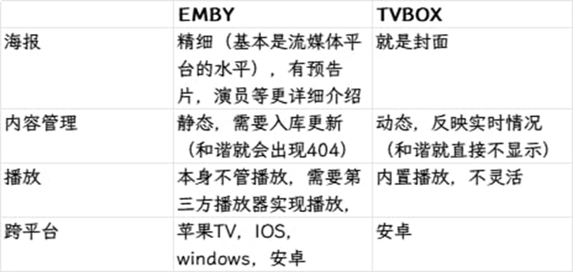

# 一、xiaoya是什么

（一）xiaoya

基于alist平台深度魔改开发的资源聚合与播放工具（非开源），整合网络上大量公开的海量阿里云盘、115网盘共享资源到统一界面，将影视、动漫、剧集等内容分门别类罗列展示，属于开箱即用型方案，不用用户自己费心寻找视频资源。借助用户个人的阿里云盘、115网盘账号，可在NAS、服务器、小主机、mac等支持docker的设备上方便快速搭建个人影音库，主打一键部署、海量影视资源、在线直连播放，包含xiaoya alist、xiaoya tvbox（已整合在xiaoya alist）、xiaoya emby等三大平台，以及爬虫等辅助工具，可通过webdav、tvbox、emby等协议对接各类媒体播放器和电视端

（二）xiaoya alist

Docker环境部署，资源占用低、加载快，对系统要求极低，N1盒子、20块/年的云服务器等设备可轻松部署，端口5678，支持索引搜索，部分资源web端可直接转码播放，支持WebDAV，可挂载到各类播放器APP（会失去搜索功能），播放时自动转存到你的中转目录，解析直链播放，自动清理，避免占用你的网盘空间

（三）xiaoya tvbox

专为电视/盒子端打造的原生播放方案，无需单独部署，安装xiaoya alist后即可使用，自动同步xiaoya alist里聚合的海量影视资源，无需自行刮削元数据，直接呈现海报墙与分类目录，支持一键播放、多清晰度切换、字幕加载，整合了饭太硬等热门tvbox源，壳子推荐使用OK影视（配置http://xxxx:5678/tvbox/my_ext_jar.json到壳子里即可），实现自动找源、切源注意事项：1、目前仅安卓可用，电脑可用模拟器运行安卓版ok影视2、用户名和密码与5678网页一致，如遇tvbox弹出用户名和密码输入框，建议先在xiaoya alist网页确保用户名密码能登陆成功

（四）xiaoya emby

xiaoya生态里的核心媒体服务，基于Emby深度适配 xiaoya alist，解决了xiaoya alist海量影视资源的可视化管理与优雅播放问题。Docker环境安装，资源占用高，系统要求高，推荐N100或以上cpu、内存8G以上、剩余空间250g的ssd的设备部署，必须要有网盘会员（详见后文），端口2345、6908（不推荐挂载使用）。可通过爬虫自动拉取与xiaoya alist精选资源元数据（strm播放地址、海报、字幕、豆瓣/TMDB 影视信息等），无需手动刮削，开箱即用就能生成精美海报墙，支持多端（手机、电视、电脑）播放，配合docker一键部署，快速搭建出无需找资源、自带精美界面的私人家庭影院

（五）xiaoya Emby和xiaoya tvbox的主要差异点

